# quick-park-assist
This is a java ,themyleaf application which is used to manage parking spot management application

# Sonar Integration
Step - 1:
    Navigate to Sonar Downloads Page"  https://www.sonarsource.com/products/sonarqube/downloads/  " scroll down and you'll Find t
    Sonar 9.9.8 LTA, and Download the Community Version.
        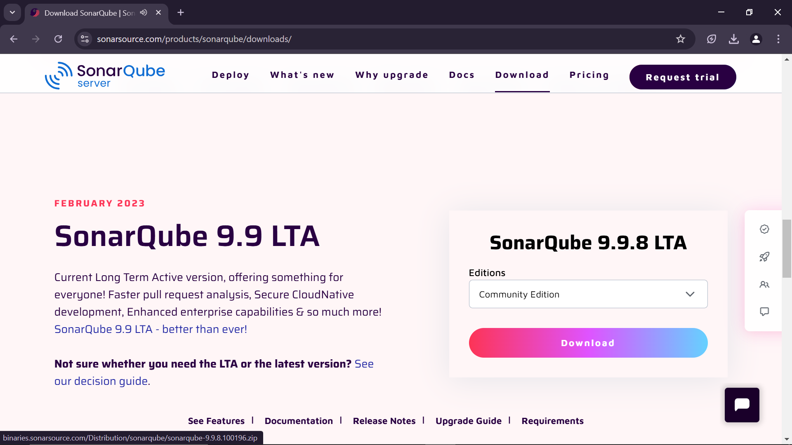

Step - 2:
    1. Now Extract the Zip file.
    2. Now Open that folder and navigate to bin --> windows-x86-64 
    3. Right Click on StartSonar and run-As-Administrator.
        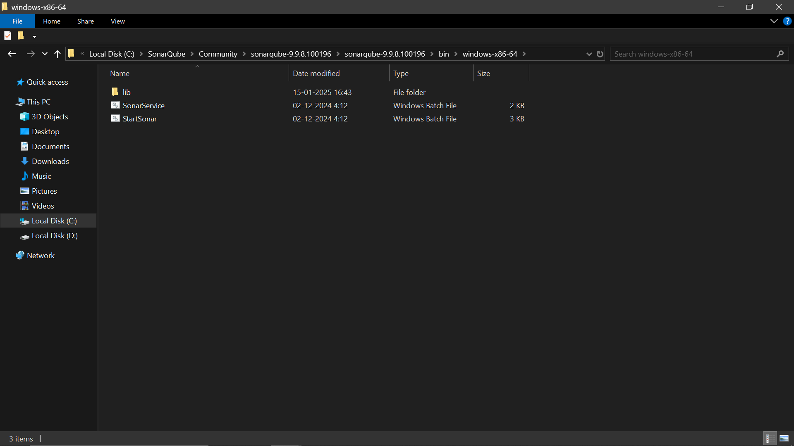

    4. Now It'll take a couple of minutes for the Sonar-Server to start.Once it is started and running It will appear like this.
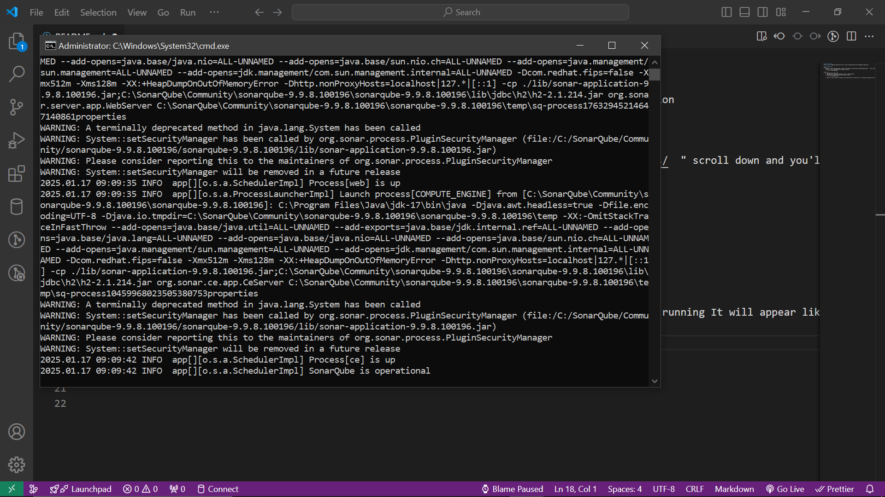

Step - 3:
    1. Now Open Browser and enter the Url = "  [localhost:9000](http://localhost:9000) "
        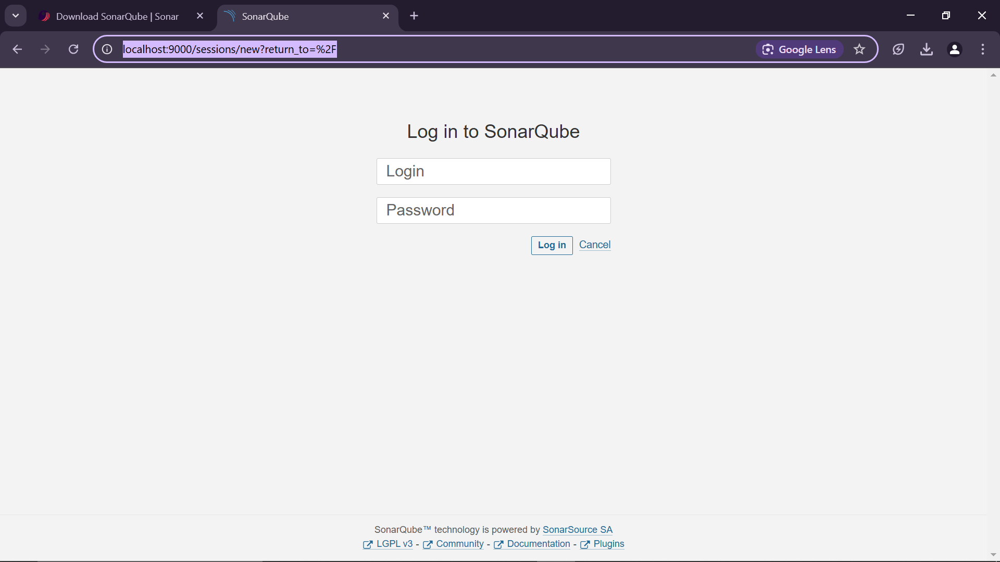
    2. For new Users the Login = "admin" and Password = ="admin" both are same. After login change the newpassword acccordingly.
    
    3.Now enter Manually: 
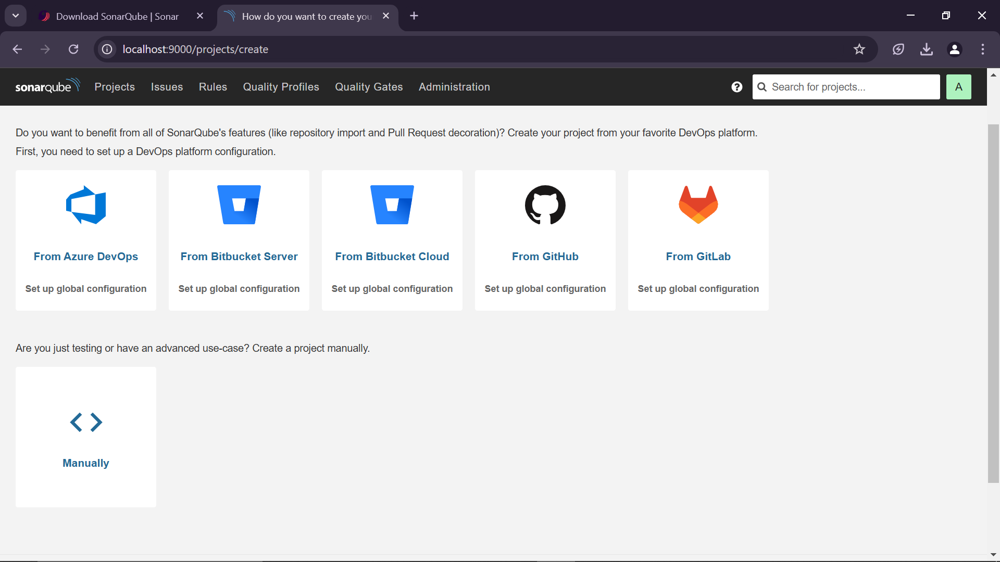
    
    4. Enter the priject - Name : quick-park-assist. And click Set-up
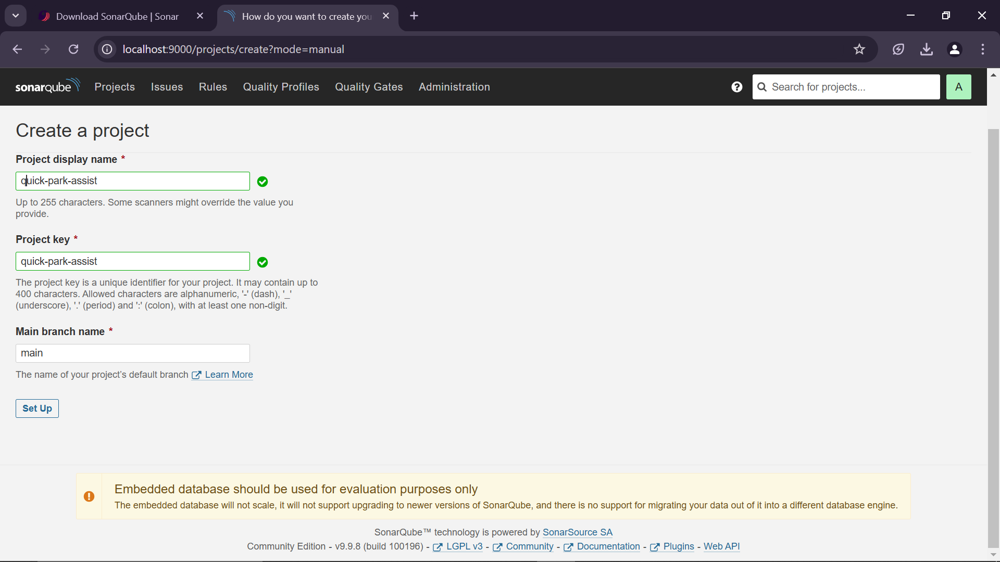 

    5.  Now Click Locally:
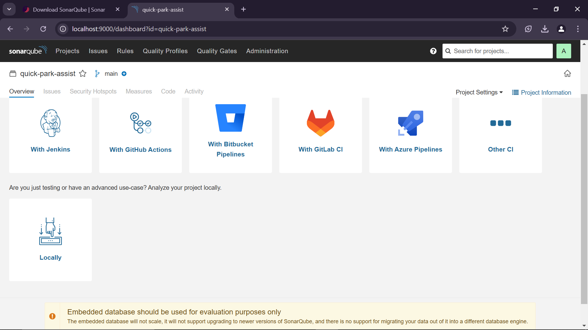
    6. Click generate  you change the expiration date as per your desire it is optional

    7. It will generrate a unique ID for Your Project:
    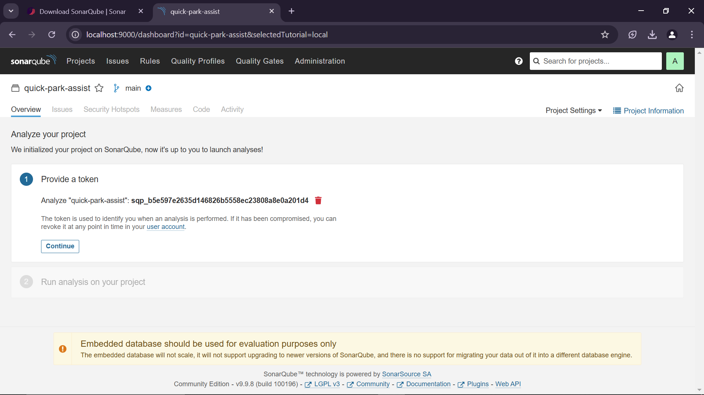
    8. Choose Maven and copy the and credentials and store them it will be required in future(IMPORTANT):
    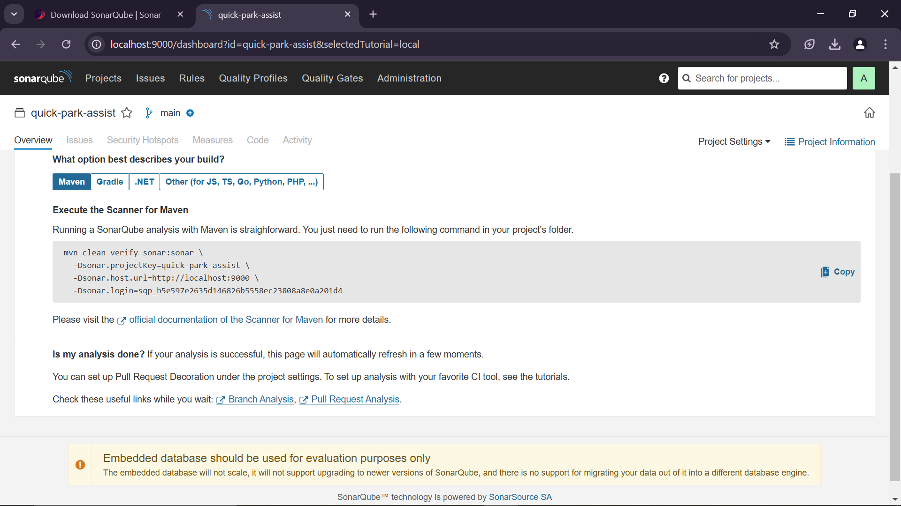

Step - 4:
    1. Go to Your Project folder:
    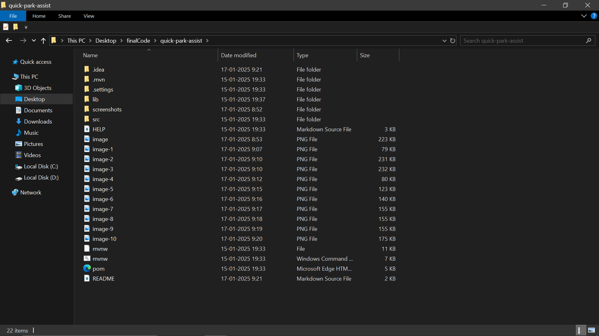
    2. Open Command-prompt from that folder:
    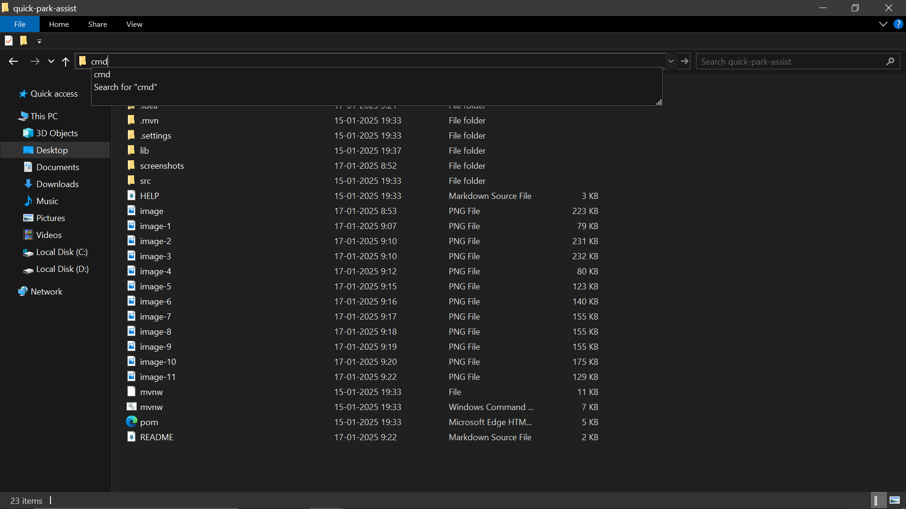
    3. Now Paste the credential which you have copied from the sonar server web-site: Remove the back-ward slashes,
    and place them in a straight line and place the entire command in the "cmd"
    mvn clean verify sonar:sonar  -Dsonar.projectKey=quick-park-assist -Dsonar.host.url=http://localhost:9000 -Dsonar.login='YOUR uniqueServerID'
    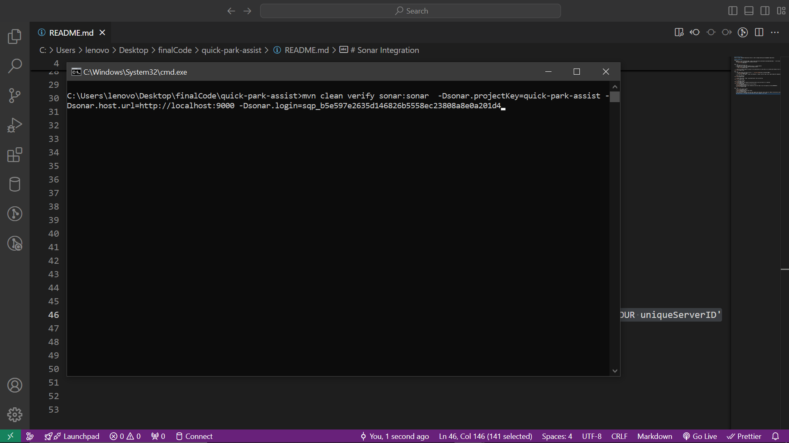
    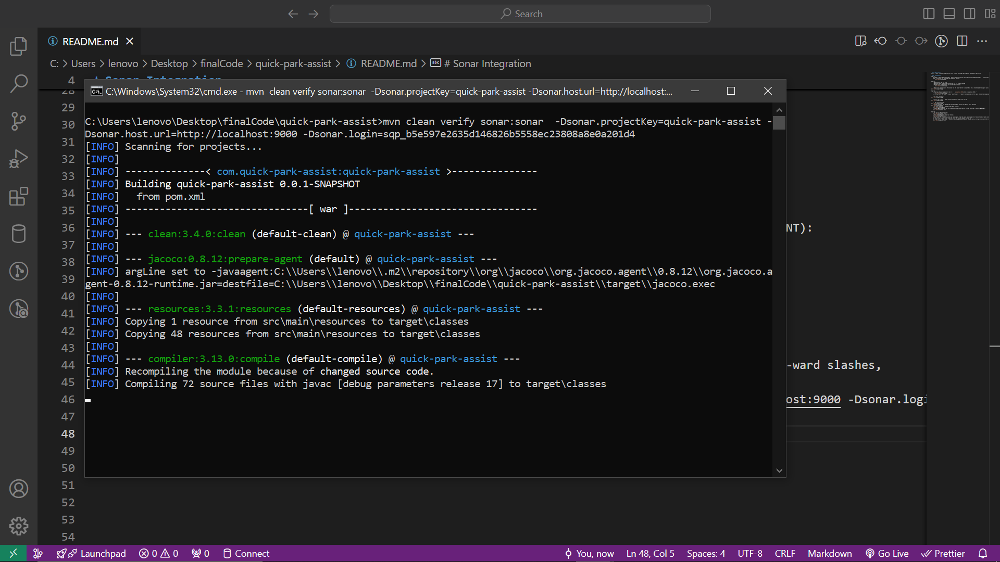

NOTE: If it gives any Error please configure MAVEN in your system.
If you do not know how to configure watch this video to configure MAVEN in your SYSTEM 
LINK: https://www.youtube.com/watch?v=3EfvEZ_wThc

